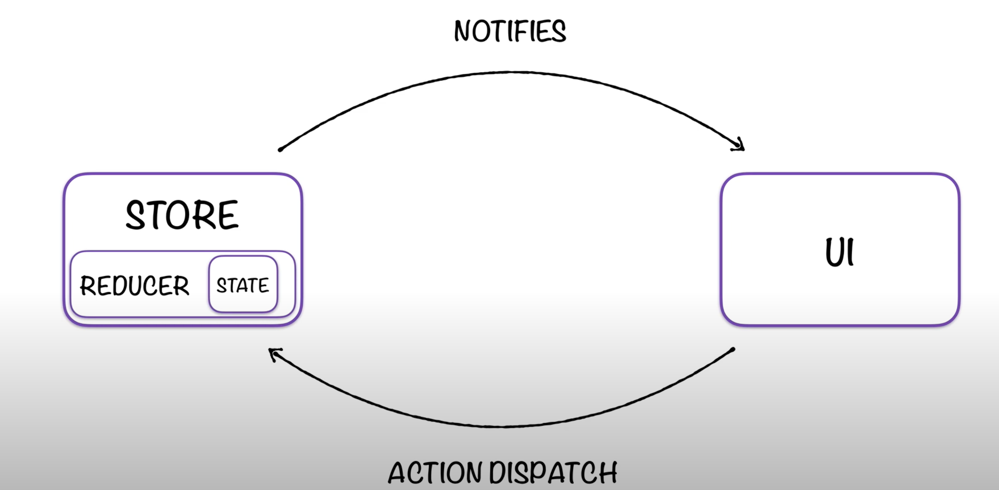

# redux_example
Esempio di Redux in Vanilla JS e in React

[Questa e'la raccolta del corso](https://www.youtube.com/playlist?list=PLfNd7po_IV0EHH6mgMRCKgI6odBKzIcyj)

# REDUX PROPS
**UNIVERSAL**: puo essere utilizzata con varie librerie JS, REACT, ANGULAR, SVELT

**TIMETRAVE**: ha un sistema di macchina del tempo puo'vedere cosa e'successo nello stato dell'applicazione

# Architettura

**UI** : interfaccia

**Store**: cercvello di redux ed e'formato da una funzione che si chiama reducer(produttore dello stato di redux). Questa funzione prende come parametro un oggetti js State (stato iniziale dell'applicazione)

Quando l' intefaccia vuole cambiare lo stato dell' apllicazione(esempio click su un bottone fare qualcosa), fa una **action dispatch**  (anche questa action e' un oggetto js)

quando lo store riceve  l'azione  dall'UI la passa al reducer che decide come modificare lo stato (NON VIENE MODIFICATO ma creata una copia di questo stato, e ritornata la copia con le opportune modifiche) 
Ogni interfaccia puo'abbonarsi alle modifiche di stato e quando c'e'una modifica lo store invia una **NOTIFIES** , quindi l'interfaccia riceve delle notifiche con la bunzione **subscrive dello store** 